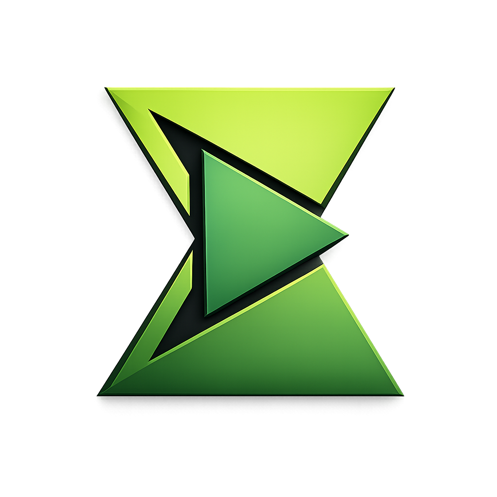

# FocusPlay

**v1.0.0** | A lightweight, distraction-free Pomodoro timer built with Wails and Go.

FocusPlay helps you manage work sessions with customizable profiles, background music, and session tracking. It's designed to help you stay focused while providing a pleasant, customizable environment.

## Features

- **Pomodoro Workflow**: Customizable work and break durations.
- **Profiles**: Create multiple profiles (e.g., "Deep Work", "Reading") with independent settings.
- **Background Audio**:
  - Play looping single tracks or shuffle entire music folders.
  - Separate audio settings for work and break sessions.
  - Supports MP3 files.
- **Mini Timer Mode**: A compact, always-on-top widget to keep track of time without distractions.
- **Session Persistence**: Automatically saves progress; resume your work exactly where you left off if the app closes.
- **Themes**: Choose from Dark, Ocean, Forest, or Minimal Black themes.
- **Statistics**: Track daily sessions and streak counts.
- **Smart Settings**: Auto-start next timer, auto-play audio, and desktop notifications.

## Project Structure

```
├── build/             # Build artifacts and installer scripts
├── docs/              # Detailed documentation
├── frontend/          # Vite + Vanilla JS frontend
│   ├── src/           # UI source code (HTML, CSS, JS)
│   └── wailsjs/       # Auto-generated Go bindings
├── internal/          # Go backend code
│   ├── app/           # Main application logic and Wails binding
│   ├── services/      # Core services (Timer, Audio, Persistence, etc.)
│   └── infra/         # Infrastructure (Storage, Events)
└── main.go            # Application entry point
```

## Prerequisites

- **Go 1.23+**
- **Node.js 18+**
- **Wails CLI**: `go install github.com/wailsapp/wails/v2/cmd/wails@latest`

## Installation

### Windows (Installer)
1. Download the latest installer from the Releases page (or `build/bin/` if built locally).
2. Run the installer (`.exe`).
3. Launch FocusPlay from your Start Menu.

### Building from Source

1. **Clone the repository:**
   ```bash
   git clone https://github.com/yourusername/focusplay.git
   cd focusplay
   ```

2. **Install dependencies:**
   ```bash
   go mod tidy
   cd frontend && npm install && cd ..
   ```

3. **Build the application:**
   - **Windows:**
     ```bash
     wails build --nsis
     ```
     *Output: `build/bin/focusplay.exe` and installer.*

   - **macOS:**
     ```bash
     wails build --platform darwin/universal
     ```

   - **Linux:**
     ```bash
     wails build --platform linux/amd64
     ```

4. **Run Development Mode:**
   ```bash
   wails dev
   ```
   *Starts the app with hot-reload for frontend changes.*

## Usage

### Keyboard Shortcuts
- **Space**: Start / Pause timer
- **Esc**: Stop timer
- **S**: Skip current session (or break)
- **M**: Toggle Mini Timer mode

### Managing Profiles
Click the **Profiles** icon (top-left) to create or edit profiles. You can set specific durations for work/break and assign specific music files or folders to each.

### Settings
Click the **Settings** icon (gear) to configure:
- Default volume
- Auto-start audio behavior
- Notifications
- Auto-start next session
- App Theme

## Architecture

FocusPlay is built using the **Wails** framework, which combines the power of Go for the backend with web technologies for the frontend.

- **Backend (Go)**: Handles the timer logic, audio playback (using `gopxl/beep`), file system interactions, and data persistence.
- **Frontend (HTML/CSS/JS)**: Provides the user interface, communicating with the backend via Wails' unified bindings.

## Documentation

- **[INSTALLATION.md](docs/INSTALLATION.md)**: Detailed build and installation steps.
- **[USAGE.md](docs/USAGE.md)**: Comprehensive user guide.
- **[CONTRIBUTING.md](docs/CONTRIBUTING.md)**: Guidelines for contributing.
- **[CHANGELOG.md](docs/CHANGELOG.md)**: Version history.

## License

See LICENSE file in the project root.
